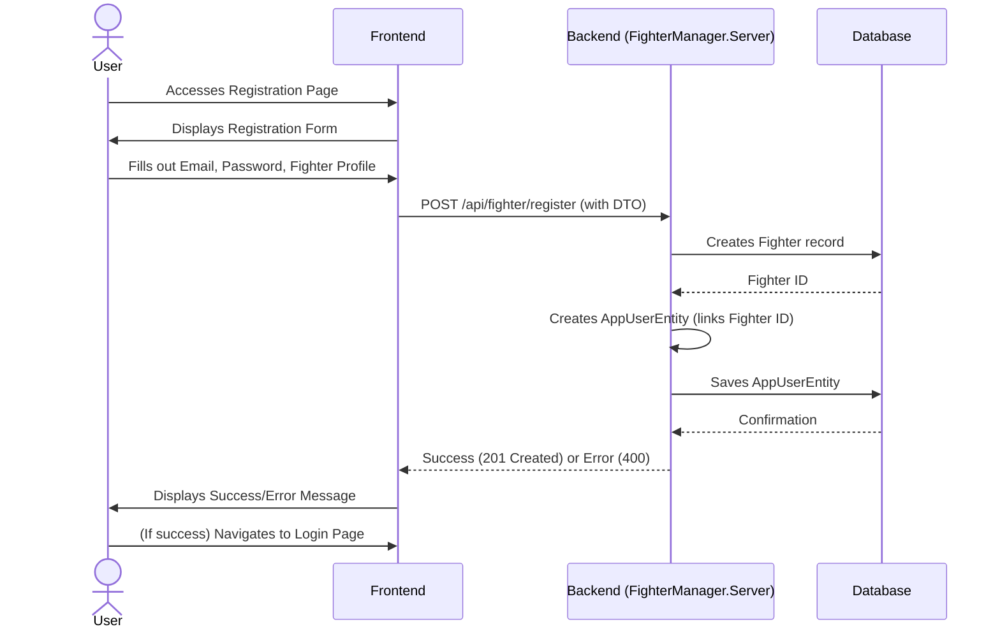
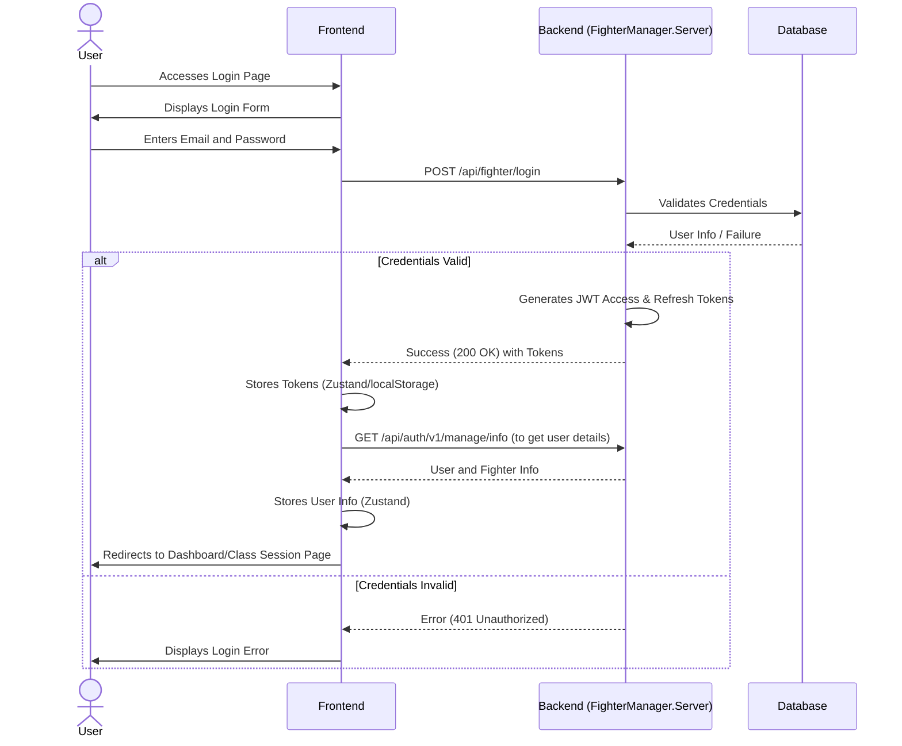
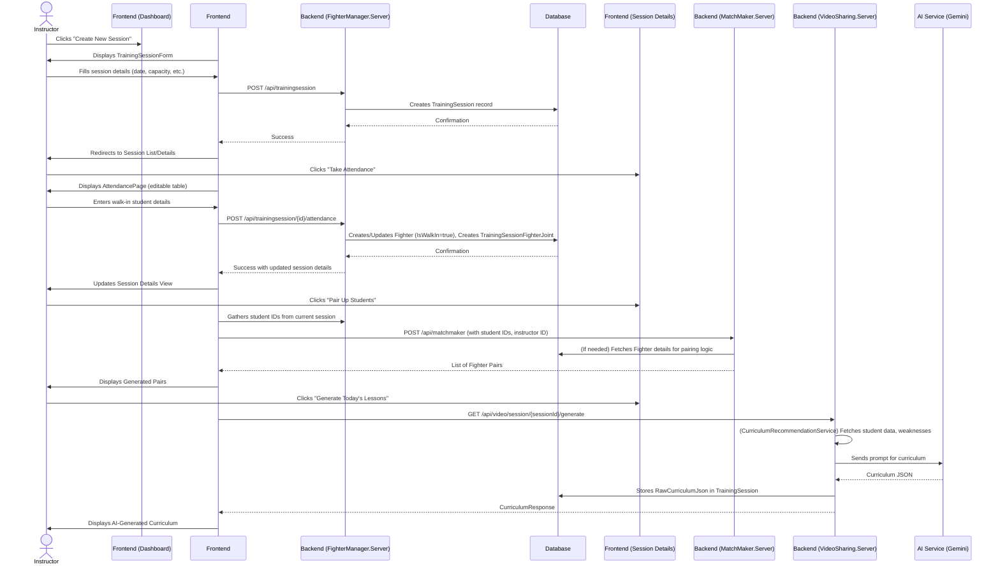
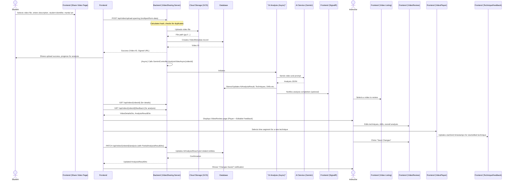

# System Flow Documentation: CodeJitsu BJJ Martial Art Training Assistant

**Version:** 1.0
**Date:** July 24, 2024

## 1. User Workflows

### 1.1 New User Registration (Email/Password)



### 1.2 User Login (Email/Password)



### 1.3 Instructor Creates and Manages a Class Session



### 1.4 Student Uploads Video for Analysis & Instructor Reviews



## 2. Data Flows
### 2.1 Video Upload and AI Analysis Data Flow

```mermaid
graph TD
    ClientApp[Client Application (React)] -- 1. Upload Video File & Metadata --> VideoSharingServer[VideoSharing.Server API]
    VideoSharingServer -- 2. Store File --> GCS[Google Cloud Storage]
    GCS -- 3. Return File Path --> VideoSharingServer
    VideoSharingServer -- 4. Create VideoMetadata Record --> AppDB[PostgreSQL Database]
    VideoSharingServer -- 5. Trigger Analysis (Async) --> GeminiVisionService[GeminiVisionService]
    GeminiVisionService -- 6. Send Video (GCS Path) & Prompt --> GeminiAPI[Google Vertex AI Gemini API]
    GeminiAPI -- 7. Return Analysis JSON --> GeminiVisionService
    GeminiVisionService -- 8. Store Raw JSON & Parsed Data --> VideoSharingServer
    VideoSharingServer -- 9. Store/Update AiAnalysisResult --> AppDB
    VideoSharingServer -- 10. (Via AiAnalysisProcessorService) Create/Link Techniques, Drills, VideoSegmentFeedbacks --> AppDB
```

### 2.2 Curriculum Generation Data Flow

```mermaid
graph TD
    ClientApp[Client Application (React)] -- 1. Request Curriculum for SessionID --> VideoSharingServer[VideoSharing.Server API]
    VideoSharingServer -- 2. (CurriculumRecommendationService) Fetch Session & Student Data --> AppDB[PostgreSQL Database]
    AppDB -- 3. Return Session, Student Fighter Profiles --> VideoSharingServer
    VideoSharingServer -- 4. Fetch Student AI Analyses (Weaknesses) --> AppDB
    AppDB -- 5. Return Relevant AiAnalysisResults --> VideoSharingServer
    VideoSharingServer -- 6. Construct Prompt (Weaknesses, Student Profiles, Session Info) --> GeminiVisionService[GeminiVisionService]
    GeminiVisionService -- 7. Send Prompt --> GeminiAPI[Google Vertex AI Gemini API]
    GeminiAPI -- 8. Return Curriculum JSON --> GeminiVisionService
    GeminiVisionService -- 9. Store RawCurriculumJson in TrainingSession --> AppDB
    GeminiVisionService -- 10. Return Parsed CurriculumResponse --> ClientApp
```

## 3. Integration points

### Frontend <-> FighterManager.Server API
- RESTful HTTP/S calls for user registration, login, fighter profile management, training session creation/management, student check-in, walk-in attendance, student pairing requests
- Authentication via JWT Bearer tokens

### Frontend <-> VideoSharing.Server API
- RESTful HTTP/S calls for YouTube video metadata sharing, GCS video uploads, triggering/retrieving AI analysis, editing AI analysis, curriculum generation/retrieval
- Authentication via JWT Bearer tokens
- SignalR for real-time notifications (e.g., video shared, analysis complete)

### Frontend <-> MatchMaker.Server API
- RESTful HTTP/S calls for student pairing (if this remains a separate service)
- Authentication via JWT Bearer tokens

### VideoSharing.Server <-> Google Cloud Storage (GCS)
- API calls using Google Cloud client libraries to upload, delete, and generate signed URLs for video files

### VideoSharing.Server <-> Google Vertex AI (Gemini)
- API calls using Google Cloud AI Platform client libraries to send video data/prompts and receive JSON-formatted analysis/curriculum

### VideoSharing.Server <-> YouTube Data API v3
- API calls using Google API client libraries to fetch video metadata (title, description) for shared YouTube URLs

### All Backend Servers <-> PostgreSQL Database
- Connection via Entity Framework Core using Npgsql provider
- Database stores all persistent application data

## 4. Error Handling

### 4.1 Client-Side (Frontend)

#### Input Validation
- Use form validation libraries (e.g., Zod with React Hook Form, or manual checks) to provide immediate feedback to users on invalid input before API calls

#### API Call Errors
- Display user-friendly error messages using Toasts or inline messages for failures (e.g., "Login failed. Please check your credentials")
- Handle specific HTTP status codes:
  - 400 Bad Request: Display validation errors returned from the API
  - 401 Unauthorized: If authStore.hydrate() fails or initial login fails, redirect to login page. For other API calls, attempt token refresh; if still fails, log out user and redirect
  - 403 Forbidden: Display an "Access Denied" message
  - 404 Not Found: Display a "Resource not found" message
  - 409 Conflict (e.g., duplicate video upload): Display specific message from API ("Duplicate video detected. This video has already been uploaded")
  - 5xx Server Error: Display a generic "An unexpected error occurred. Please try again later" message
- Log detailed errors to the browser console for debugging

#### State Management Errors
- Catch errors in Zustand store actions and update UI accordingly (e.g., set an error state)

### 4.3 Server-Side (Backend - All Services)

#### Request Validation
- Use Data Annotations on DTOs for basic validation
- Implement custom validation logic in controllers or services for complex rules
- Return 400 Bad Request with a ValidationProblemDetails (or custom error DTO) body detailing the errors

#### Authentication & Authorization
- ASP.NET Core Identity handles many authentication errors (e.g., invalid password)
- JWT middleware handles token validation errors, returning 401 Unauthorized
- Custom authorization policies/filters return 403 Forbidden

#### Business Logic Errors
- Throw custom exceptions (e.g., VideoNotFoundException, DuplicateVideoException) or use a structured error response pattern
- Catch specific exceptions in controllers and map them to appropriate HTTP status codes (e.g., NotFoundResult, ConflictResult)
- The existing ErrorResponseException and BaseFilter in VideoSharing.Server/Helpers/ provide a good starting point for structured error responses. This pattern should be consistently applied across all backend services

#### Database Errors
- Catch DbUpdateException (e.g., for constraint violations) and translate to user-friendly errors or 409 Conflict
- Handle transient database connection issues with retry policies if appropriate (though EF Core might handle some)

#### External Service Errors (YouTube, GCS, Gemini)
- Wrap API calls in try-catch blocks
- Log detailed error information from the external service
- Return appropriate HTTP status codes to the client (e.g., 502 Bad Gateway or 503 Service Unavailable if the external service is down, or 500 Internal Server Error if it's an unexpected issue processing the response)
- For Gemini JSON parsing failures, log the raw JSON received and return a 500 Internal Server Error indicating an issue with AI response processing

#### Global Exception Handling
- Implement a global exception handler middleware in each ASP.NET Core application (Startup.cs or Program.cs) to catch unhandled exceptions, log them, and return a generic 500 Internal Server Error response to the client to avoid leaking sensitive information. The existing BaseFilter serves a similar purpose at the action level

#### Logging
- Use Serilog for structured logging across all backend services
- Log errors with sufficient context (request ID, user ID if available, stack trace, relevant parameters)
- Log warnings for non-critical issues (e.g., failed deserialization of optional AI data parts)